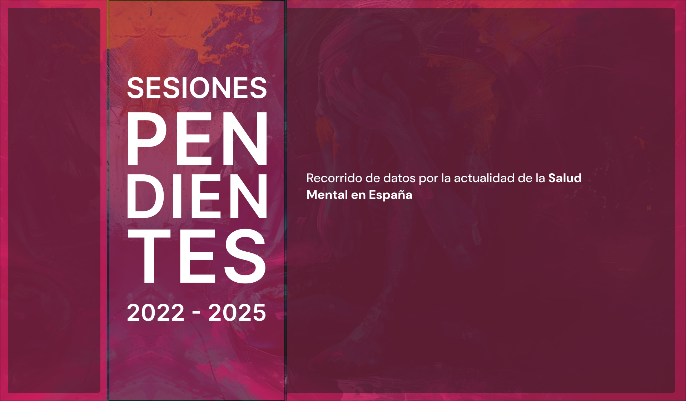
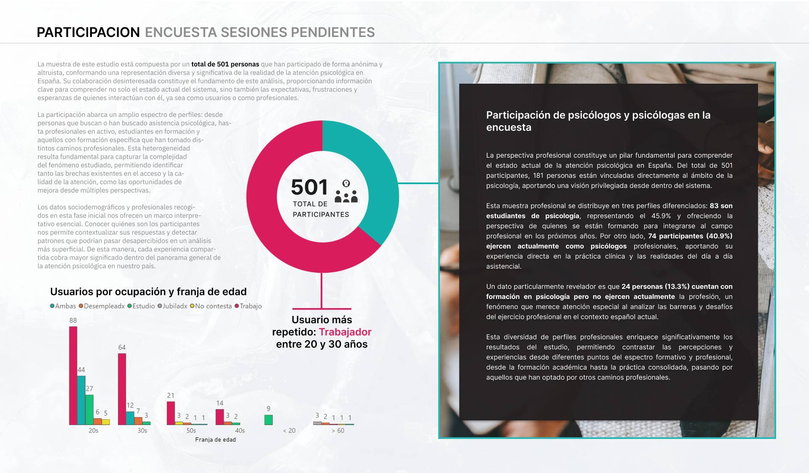
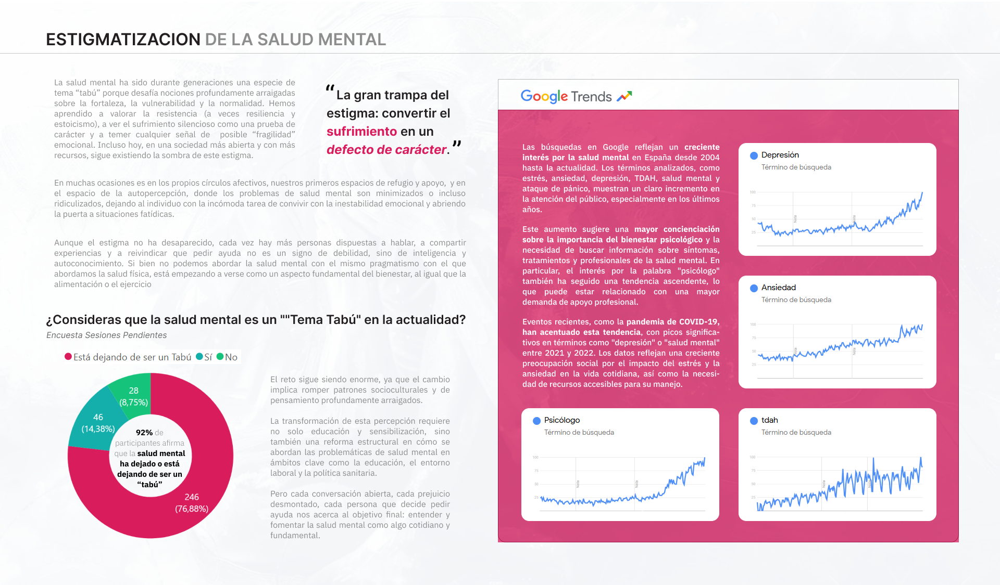
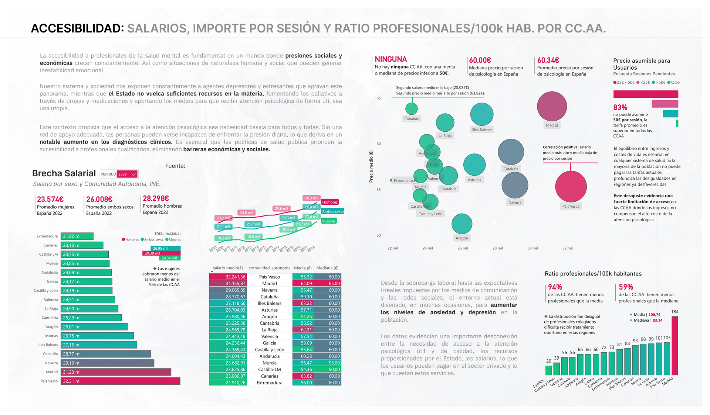

# Sesiones Pendientes: Salud Mental en España 

Recorrido por la accesibilidad a **Atención Psicológica en España** a través de datos de fuentes oficiales e investigación independiente.


## **Descripción del Proyecto**
Este proyecto es un **análisis exploratorio y visualización de datos** sobre la situación actual de la atención psicológica en España.  
Se han recopilado datos de diversas fuentes para estudiar la relación entre los diversos factores socioculturales, demográficos, logístico-técnicos y económicos involucrados en la materia.






## **Fuentes de Datos**

### '📁 EDA_Sesiones-Pendientes_Salud-mental-Espana/data' para consultar Fuentes. 
- **Sesiones Pendientes**: *Encuesta independiente*, 2022-2025.
- **La situación de la Salud Mental en España**, *Ministerio de Sanidad, Consumo y Bienestar Social*, 2023.
- **Informe EDADES**, *Ministerio de Sanidad, Consumo y Bienestar Social*, 2023.
- **Encuesta Nacional de Salud**, *Ministerio de Sanidad, Consumo y Bienestar Social*, 2017.
- **Salud mental según sexo y grupo de edad. Población de 15 y más años**, *INE (Instituto Nacional de Estadística)*, 2019-2020.
- **Población por edad (grupos quinquenales), Españoles/Extranjeros, Sexo  y Año**, *INE (Instituto Nacional de Estadística)*, 1998-2022.
- **Defunciones por comunidad y ciudad autónoma de residencia, causas (lista reducida), sexo y edad.**, *INE (Instituto Nacional de Estadística)*, 1998-22.
- **Ganancia media anual por sexo y edad**, *INE (Instituto Nacional de Estadística)*, 2008-2022.
- **Nº de Psicólogos por Comunidades, Ciudades autónomas y Provincias de colegiación, situación laboral y sexo.**, *INE (Instituto Nacional de Estadística)*, 2023.
- **Prevalencia de cuadros depresivos activos según sexo y grupo de edad. Población de 15 y más años.**, *Encuesta Europea de Salud*, 2020.
- **Severidad de la sintomatología depresiva según sexo y grupo de edad. Población de 15 y más años.**, *Encuesta Europea de Salud*, 2020.
- **Gasto en productos farmacéuticos y sanitarios**, *Ministerio de Hacienda*, 2014-2024.
- **Presupuestos Generales del Estado**, *BOE (Boletín Oficial del Estado)*, 2008-2024.
- **Profesionales activos por CC.AA., especialidad y tarifas** *Dorctoralia (web scraping)*, 2024.


## **Objetivos del Proyecto**
✓ Analizar la **brecha de acceso** a la atención psicológica en España.  
✓ Identificar las **desigualdades entre comunidades autónomas**.  
✓ Comparar **los precios de las sesiones** con los **ingresos promedio** de la población.  
✓ Reflexionar sobre el **impacto de los salarios y disponibilidad de profesionales** en el acceso a la salud mental.

## **Principales Insights**

📊 Importante **Brecha salarial** entre CC.AA. y entre hombres y mujeres.   
📊 **16 de 17 CC.AA. tienen menos psicólogos por cada 100k habitantes que la media.**   
📊Madrid tiene casi **184 psicólogos por cada 100k habitantes (1º)**, mientras que algunas comunidades tienen menos de **30**.   
📊 **83% de los encuestados** afirman que no pueden pagar más de 50€ por sesión, pero **ninguna comunidad autónoma** tiene una media de precios inferior a esa cantidad.    
📊 **Canarias** es la comunidad con el **segundo salario más bajo** y el **segundo precio más alto** por sesión.    
📊 La Rioja y Andalucía también presentan una correlación negativa salario-precio.  
📊 **País Vasco** presenta la mejor correlación entre **salario medio alto** y **precio de sesión bajo**. 


## **Tecnología**
🔹 **Python** | ```pandas```, ```beautifulSoup```, ```csv```     
🔹 **Power BI** | **DAX**   
🔹 **Google Forms** | **Google Trends**     
🔹 **Visual Studio**     
🔹 **LibreOffice** 


## 📂 **Estructura del Proyecto**
```
📦 Sesiones-Pendientes
 ┣ 📂 data/     
 ┃ ┣ 📂 clean/   # Archivos de datos limpios
 ┃ ┣ 📂 raw/   # datasets originales, resultados de scraping y encuestas
 ┣ 📂 DAX/   # Cálculos para Power BI / Tableau
 ┣ 📂 ETL/  # Scripts de procesamiento de datos
 ┣ 📄 Sesiones-Pendientes.pbit  # Plantilla de Power BI
 ┣ 📄 Sesiones-Pendientes.pdf   # Reporte en PDF
 ┗ 📄 Sesiones-Pendientes.png   # Imagen del Dashboard
```

## **Descarga y Uso**
1️⃣ **Clona el repositorio**  
```bash
git clone https://github.com/barrierj93/Sesiones-Pendientes.git
```
2️⃣ **Abre el archivo en Power BI o Tableau**  
3️⃣ **Explora los datos y visualizaciones**  


· Cualquier aporte es bienvenido ·


## 🏛 **Licencia**
📜 Este proyecto está bajo la **Licencia MIT** - Puedes usarlo libremente con atribución.

---
